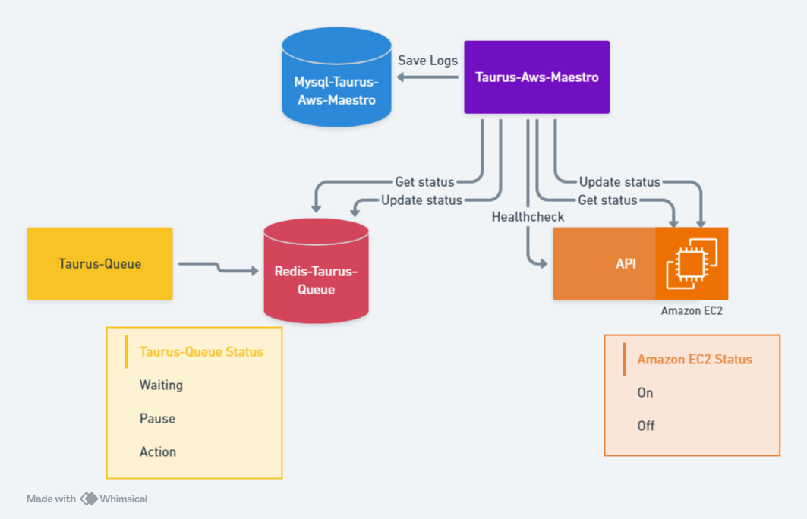

# Taurus AWS Maestro (v2)

[](http://makeapullrequest.com)

**Taurus AWS Maestro** automatically starts/stops EC2 instances and pauses/unpauses queues based on demand.

**What’s new in v2**

* **Rule‑oriented orchestration**: Group multiple queues + healthchecks + instances into a **rule**. Scaling decisions are made per rule, not per queue.
* **Pluggable drivers**: Run against **AWS + real Taurus**, or entirely **offline** using **file‑backed fakes**.
* **Deterministic healthchecks**: File‑controlled health behavior (e.g., “fail N times, then succeed”).



---

## Quickstart

### 1) Clone & compose

```bash
git clone https://github.com/not-empty/taurus-aws-switcher.git
cd taurus-aws-switcher
```

### 2) Environment

Copy `.env.example` → `.env` and adjust. New drivers envs:

* `MAESTRO_EC2_DRIVER`: `aws` | `file`
* `MAESTRO_TAURUS_DRIVER`: `taurus` | `file`
* `MAESTRO_REQUEST_DRIVER`: `http` | `file`

> When using `file`, Maestro reads/writes hardcoded paths under `./fake_data/`.

### 3) Config

Create/adjust `config.json` (rule‑oriented):

```json
{
  "rules": [
    {
      "name": "rule1",
      "min_on_time": 30,
      "queues": ["queue1", "queue2"],
      "healthchecks": [
        "http://api1/health",
        "http://api2/health",
        "http://api3/health"
      ],
      "instance_ids": [
        "i-0123456789abcdef0",
        "i-0abcdef1234567890"
      ]
    },
    {
      "name": "rule2",
      "queues": ["another_queue"],
      "min_on_time": 30,
      "healthchecks": [],
      "instance_ids": ["i-0abcdef1234567321"]
    }
  ]
}
```

### 4) Run

```bash
docker-compose up -d
```

---

## How rules work

A **rule** ties together:

* **queues**: one or more Taurus queues
* **instance\_ids**: EC2 instances backing those queues
* **healthchecks**: HTTP endpoints to verify app readiness
* **min\_on\_time**: minimum time (seconds) instances remain on after (re)start

**Behavior**

* **Work present (any queue > 0)** → ensure instances **running**.

  * If healthchecks are configured: check them **before** unpausing queues.
  * If no healthchecks: unpause immediately.
* **All queues idle** → pause any **unpaused** queues, then stop any **running** instances.
* **Queues are never re‑paused unnecessarily** and are only unpaused when instances are confirmed up (and healthy, if applicable).

---

## Drivers & fake data

Set these envs to choose real vs fake backends:

```
MAESTRO_EC2_DRIVER=aws      # aws | file
MAESTRO_TAURUS_DRIVER=taurus# taurus | file
MAESTRO_REQUEST_DRIVER=http # http | file
```

When using `file`, Maestro uses **hardcoded** paths under `./fake_data/`:

* **EC2 fake**: `./fake_data/ec2_state.json`

  ```json
  { "instances": { "i-0123456789abcdef0": "stopped", "i-0abcdef1234567890": "stopped" } }
  ```

  Accepted states: `running`, `stopped` (Maestro will flip them as it “starts/stops”).

* **Taurus fake**: `./fake_data/taurus_state.json`

  ```json
  {
    "queues": {
      "queue1": { "waiting": 0, "active": 0, "paused": 0, "is_paused": false },
      "queue2": { "waiting": 3, "active": 1, "paused": 0, "is_paused": false }
    }
  }
  ```

  You can edit counts to simulate load. Pausing moves `waiting → paused`; unpausing returns `paused → waiting`.

* **Requests fake**: `./fake_data/requests_state.json`

  ```json
  {
    "endpoints": {
      "http://api1/health": { "fails_before_success": 1 },
      "http://api2/health": { "fails_before_success": 1, "latency_ms": 40 },
      "http://api3/health": { "fails_before_success": 2 }
    }
  }
  ```

  Each endpoint returns **503** for N checks, then **200** forever; optional `latency_ms` adds delay.

---

## .env.example

```env
AWS_ACCESS_KEY_ID=
AWS_SECRET_ACCESS_KEY=
AWS_REGION=

DEBUG_MODE=1

LOG_SCHEDULES=1
LOG_EVENTS=1
LOG_QUEUES=1
LOG_ACTIONS=1

MAESTRO_EC2_DRIVER=aws
MAESTRO_TAURUS_DRIVER=taurus
MAESTRO_REQUEST_DRIVER=http

MYSQL_HOST=localhost
MYSQL_USER=root
MYSQL_PASSWORD=root
MYSQL_DATABASE=taurus-maestro

REDIS_HOST=taurus-redis
REDIS_PORT=6379
REDIS_DB=0

SAVE_DB_HISTORY=1

TIME_SCAN_QUEUE_SCHEDULE=60
TIME_SCAN_EC2_STARTED_SCHEDULE=60
TIME_SCAN_EC2_STOPPED_SCHEDULE=60
TIME_SCAN_API_HEALTHCHECK_SCHEDULE=60
```

**Notes**

* `DEBUG_MODE=1` prints extra logs.
* Set `SAVE_DB_HISTORY=0` to disable DB writes.
* For offline tests, set all drivers to `file` and edit `./fake_data/*`.

---

## Logs & scheduling

* **LOG\_SCHEDULES / LOG\_EVENTS / LOG\_QUEUES / LOG\_ACTIONS** toggle verbosity.
* Schedulers:

  * `TIME_SCAN_QUEUE_SCHEDULE`: base scan cadence
  * `TIME_SCAN_EC2_STARTED_SCHEDULE`: recheck while instances are starting
  * `TIME_SCAN_EC2_STOPPED_SCHEDULE`: recheck while stopping
  * `TIME_SCAN_API_HEALTHCHECK_SCHEDULE`: cadence for retrying healthchecks

---

## Run modes

**Production** (real AWS, real Taurus, real HTTP):

change the envs to the real drivers
```env
MAESTRO_EC2_DRIVER=aws
MAESTRO_TAURUS_DRIVER=taurus
MAESTRO_REQUEST_DRIVER=http
DEBUG_MODE=0
```

**Offline** (all fake):

change the envs to the fake drivers
```bash
MAESTRO_EC2_DRIVER=file
MAESTRO_TAURUS_DRIVER=file
MAESTRO_REQUEST_DRIVER=file
DEBUG_MODE=1
```

Then edit `./fake_data/*.json` to simulate load and state.

---

## Troubleshooting

* **Healthcheck says “not configured”**: ensure exact URL keys exist in `./fake_data/requests_state.json` or switch to real HTTP driver.
* **Queues never unpause**: check that healthchecks eventually reach HTTP 200 (fake file or real endpoints).

---

**Not Empty Foundation — Free codes, full minds**
